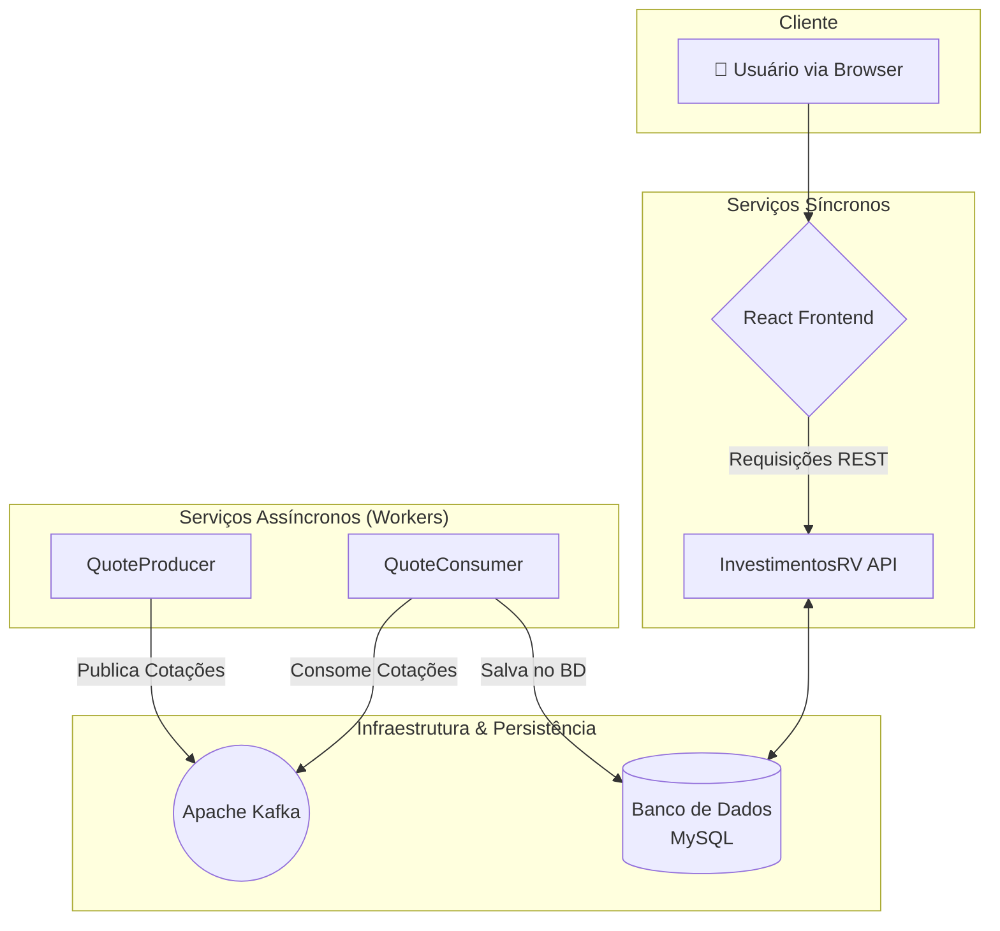

# CamarãoInvestimentos: Plataforma de Controle de Renda Variável 📈

<p align="center">
  
</p>

<p align="center">
  <strong>Solução completa para o Desafio Técnico Itaú Unibanco, demonstrando uma arquitetura de microsserviços resiliente e escalável para gerenciamento de investimentos em renda variável.</strong>
</p>

<p align="center">
  
  
  
  
  
</p>

## 🎯 Sobre o Projeto

CamarãoInvestimentos é uma aplicação full-stack que simula um ambiente onde um usuário pode gerenciar seu portfólio de investimentos. A solução foi projetada com foco em boas práticas de engenharia de software, incluindo Clean Architecture, microsserviços, mensageria assíncrona, resiliência e uma suíte de testes robusta.

---

## 🏛️ Diagrama da Arquitetura

O sistema é composto por serviços independentes que se comunicam de forma síncrona (via API REST) e assíncrona (via Apache Kafka), garantindo desacoplamento e escalabilidade.



---


## 🖼️ Exemplos de Telas da Aplicação

<p align="center">
  <strong>🔹 Landing Page</strong><br/>
  
</p>

<p align="center">
  <strong>🔹 Tela de Registro</strong><br/>
  
</p>

<p align="center">
  <strong>🔹 Dashboard (sem dados)</strong><br/>
  
</p>

<p align="center">
  <strong>🔹 Dashboard Atualizado</strong><br/>
  
</p>

<p align="center">
  <strong>🔹 Tela de Operações</strong><br/>
  
</p>

<p align="center">
  <strong>🔹 Parte Inferior das Operações</strong><br/>
  
</p>


## ✨ Funcionalidades

* **API Principal (`InvestimentosRV`):** Uma API RESTful .NET seguindo os princípios da **Clean Architecture** para gerenciar usuários, ativos, operações e posições.
* **Produtor de Cotações (`QuoteProducer`):** Um serviço de background que busca cotações de mercado e as publica em um tópico Kafka, simulando um feed de dados em tempo real.
* **Consumidor de Cotações (`QuoteConsumer`):** Um Worker Service que consome as cotações do Kafka, salva-as no banco de dados e recalcula o P&L (Lucro e Prejuízo) das posições dos clientes.
* **Testes de Qualidade:** Suíte de testes unitários com **xUnit** e testes de mutação com **Stryker.NET**.
* **Resiliência:** Implementação do padrão **Circuit Breaker** com Polly para garantir a estabilidade do sistema contra falhas em serviços externos.
* **Documentação Interativa:** Geração automática de documentação da API com **Swagger (OpenAPI)**.

---

## 🚀 Como Executar o Projeto

A aplicação é dividida em duas partes principais: o **Back-end** (API, Workers, Banco de Dados, Kafka) que roda em contêineres Docker, e o **Front-end** (React) que é executado localmente para uma melhor experiência de desenvolvimento.

### Pré-requisitos
* **Docker** e **Docker Compose** instalados.
* **Node.js** (v18 ou superior) e **npm** ou **Yarn** instalados.
* **.NET SDK 8** instalado.

### Parte 1: Executando o Back-end e a Infraestrutura (Docker)

Esta parte irá subir todos os serviços de back-end, a API, o banco de dados e a infraestrutura de mensageria.

1.  **Clone o repositório:**
    ```bash
    git clone (https://github.com/HumbertoVitalino/desafio-renda-variavel.git)
    cd desafio-renda-variavel
    ```
2.  **Suba os Contêineres do Docker Compose:**
    Na raiz do projeto, execute o seguinte comando:
    ```bash
    docker-compose up --build -d
    ```
    Este comando irá:
    * Construir as imagens Docker para a API, o `QuoteProducer` e o `QuoteConsumer`.
    * Iniciar os contêineres para MySQL e Kafka/Zookeeper.
    * Executar automaticamente os scripts SQL para criar o esquema do banco e populá-lo com dados iniciais.

Após a conclusão, todos os serviços de back-end estarão rodando e prontos para receber requisições.

### Parte 2: Executando o Front-end (Manual)

Com o back-end no ar, execute a interface de usuário em um terminal separado.

1.  **Navegue até a pasta do front-end:**
    ```bash
    # A partir da raiz do projeto
    cd Frontend 
    ```
2.  **Instale as dependências:**
    ```bash
    npm install
    ```
3.  **Inicie o servidor de desenvolvimento do React:**
    ```bash
    npm run dev
    ```

### Parte 3: Acessando a Aplicação

Agora, com tudo rodando, você pode acessar as seguintes URLs no seu navegador:

* **Aplicação Front-end:** ➡️ [http://localhost:5173](http://localhost:5173)
* **Documentação da API (Swagger):** ➡️ [http://localhost:5000/swagger](http://localhost:5000/swagger)
---

## 🧪 Estratégia de Testes

A qualidade do código é garantida por duas camadas de testes no back-end:

### Testes Unitários (xUnit)
Foram criados testes unitários para validar a lógica de negócio mais crítica do sistema, cobrindo cenários de sucesso e de erro (casos de borda). A suíte utiliza `xUnit` como framework, `Moq` para a criação de mocks e `Bogus` para a geração de dados de teste.

### Testes de Mutação (Stryker.NET)
Para avaliar a eficácia da suíte de testes unitários, foi empregado o Teste de Mutação com o Stryker.NET. Esta técnica insere "bugs" deliberados no código para verificar se os testes existentes são capazes de detectá-los. Um exemplo prático foi a mutação no cálculo do preço médio: ao trocar `+` por `-`, os testes unitários falharam, provando sua robustez e "matando o mutante".

---

## 🔧 Detalhes Técnicos da Implementação

### Modelagem do Banco de Dados (Code-First)
A modelagem foi feita com **Entity Framework Core (Code-First)**. As tabelas abaixo representam as entidades principais do domínio e suas justificativas de design.

<details>
<summary><strong>Clique para expandir os detalhes das tabelas e índices</strong></summary>

### Tabela: `usuarios`
Armazena as informações de cada usuário cadastrado na plataforma, incluindo suas credenciais e configurações de corretagem.

| Nome da Coluna | Tipo de Dado | Justificativa |
| :--- | :--- | :--- |
| `id_usuario` | `int AUTO_INCREMENT` | Chave primária numérica padrão. O `AUTO_INCREMENT` garante a unicidade e simplifica a inserção. |
| `nome` | `varchar(255)` | Tipo de texto de tamanho variável, ideal para nomes de diferentes comprimentos, economizando espaço. |
| `email` | `varchar(255) UNIQUE` | Similar ao `nome`, mas com uma restrição `UNIQUE` para garantir que não existam dois usuários com o mesmo email. |
| `senha_hash`, `senha_salt` | `longblob` | `BLOB` (Binary Large Object) é o tipo correto para armazenar os arrays de bytes brutos gerados pelo algoritmo de hash da senha. |
| `taxa_corretagem` | `decimal(5,4)` | **Essencial para valores financeiros.** O tipo `DECIMAL` evita os erros de precisão de ponto flutuante. A precisão `(5,4)` permite armazenar taxas percentuais com alta acurácia (ex: `0.0050`). |
| `perfil_investidor` | `int` | Armazena a representação numérica do `enum` `InvestorProfile`, uma forma eficiente de guardar dados categóricos. |

### Tabela: `ativos`
Mantém um catálogo de todos os ativos financeiros disponíveis para negociação no sistema.

| Nome da Coluna | Tipo de Dado | Justificativa |
| :--- | :--- | :--- |
| `id_ativo` | `int AUTO_INCREMENT` | Chave primária numérica padrão. |
| `codigo_ativo` | `varchar(10) UNIQUE` | Armazena o "ticker" do ativo (ex: 'ITSA4'). A restrição `UNIQUE` impede a duplicidade de ativos. |
| `risco_ativo` | `int` | Armazena a representação numérica do `enum` `AssetRisk`, categorizando o risco do ativo (Baixo, Médio, Alto). |

### Tabela: `operacoes`
Um registro histórico (log) de todas as transações de compra e venda realizadas pelos usuários.

| Nome da Coluna | Tipo de Dado | Justificativa |
| :--- | :--- | :--- |
| `id_operacao` | `int AUTO_INCREMENT` | Chave primária única para cada transação. |
| `id_usuario`, `id_ativo` | `int` | Chaves estrangeiras que criam o relacionamento com as tabelas `usuarios` e `ativos`, garantindo a integridade referencial dos dados. |
| `preco_unitario` | `decimal(18,8)` | Tipo `DECIMAL` para garantir a precisão monetária. A precisão `(18,8)` foi escolhida para suportar uma vasta gama de preços de ativos sem perda de informação. |
| `valor_corretagem` | `decimal(18,8)` | Mesmo motivo do `preco_unitario`, garantindo a exatidão no cálculo de taxas. |
| `tipo_operacao` | `int` | Armazena o `enum` `OperationType` (1 para Compra, 2 para Venda). |

### Tabela: `cotacoes`
Armazena o histórico de preços dos ativos ao longo do tempo, alimentado por um serviço de background.

| Nome da Coluna | Tipo de Dado | Justificativa |
| :--- | :--- | :--- |
| `id_cotacao` | `int AUTO_INCREMENT` | Chave primária. |
| `id_ativo` | `int` | Chave estrangeira para a tabela `ativos`. |
| `preco_unitario` | `decimal(18,8)` | Essencial para a precisão do preço de mercado do ativo. |
| `data_hora_cotacao` | `datetime(6)` | Armazena o timestamp exato da cotação. A precisão `(6)` permite registrar até microssegundos, crucial para dados de mercado que mudam rapidamente. |

### Tabela: `posicoes`
Representa um snapshot consolidado da carteira de um usuário para um ativo específico.

| Nome da Coluna | Tipo de Dado | Justificativa |
| :--- | :--- | :--- |
| `id_posicao` | `int AUTO_INCREMENT` | Chave primária. |
| `id_usuario`, `id_ativo` | `int` | Chaves estrangeiras. Juntas, formam um **índice único** para garantir que um usuário só pode ter uma entrada de posição por ativo. |
| `preco_medio` | `decimal(18,8)` | `DECIMAL` para a precisão do cálculo do preço médio ponderado, que é o coração da lógica de P&L. |
| `lucro_prejuizo_atual`| `decimal(18,8)` | `DECIMAL` para a precisão do P&L (Profit & Loss), que é um valor financeiro calculado. |

#### Índices e Otimizações de Performance

Para garantir a performance das consultas e a integridade dos dados, os seguintes índices foram implementados no banco de dados:

| Índice | Tabela e Colunas | Justificativa / Propósito |
| :--- | :--- | :--- |
| `IX_usuarios_email` | `usuarios` (`email`) | **Índice Único** para garantir que não haja emails duplicados e acelerar a busca de usuários durante o processo de login. |
| `IX_ativos_codigo_ativo` | `ativos` (`codigo_ativo`) | **Índice Único** para garantir que cada ticker de ativo seja único no sistema e otimizar a busca de ativos pelo seu código. |
| `ix_operacoes_usuario_ativo_data` | `operacoes` (`id_usuario`, `id_ativo`, `data_hora_operacao`) | **Índice Composto** criado especificamente para atender ao requisito da **Tarefa 2**. Ele otimiza drasticamente a consulta de "todas as operações de um usuário em determinado ativo nos últimos 30 dias". |
| `IX_posicoes_id_usuario_id_ativo`| `posicoes` (`id_usuario`, `id_ativo`) | **Índice Único Composto** que reforça a regra de negócio de que um usuário só pode ter uma única linha de posição por ativo. Também acelera a busca da posição específica de um cliente. |
| `IX_cotacoes_id_ativo_data_hora_cotacao`| `cotacoes` (`id_ativo`, `data_hora_cotacao`) | **Índice Único Composto** para otimizar a busca das cotações mais recentes de um ativo e garantir que não haja cotações duplicadas para o mesmo ativo no mesmo instante. |

</details>

### Resiliência e Engenharia do Caos (Polly)
Para garantir a resiliência contra falhas em serviços externos (como uma API de cotações), o padrão **Circuit Breaker** foi implementado no `QuoteProducer` utilizando a biblioteca **Polly**.

* **Circuit Breaker:** Após 3 falhas consecutivas, o circuito "abre" por 60 segundos, impedindo novas chamadas e permitindo que o serviço dependente se recupere.
* **Fallback:** Durante o estado "aberto", uma política de fallback é acionada, registrando um log de aviso em vez de quebrar a aplicação.
* **Observabilidade:** As mudanças de estado do circuito (`onBreak`, `onReset`) são registradas em logs, permitindo monitorar a saúde das integrações.

### Escalabilidade e Balanceamento de Carga
A arquitetura containerizada com Docker e desacoplada com Kafka é inerentemente escalável. Em um ambiente de nuvem (AWS, Azure, GCP), os serviços `Api` e `QuoteConsumer.Worker` podem ser configurados com **auto-scaling horizontal** baseado em métricas de CPU, memória ou no tamanho da fila do Kafka. A estratégia de balanceamento de carga recomendada para a API seria a de **Menor Latência (Least Latency)**, para garantir a melhor experiência ao usuário final.

### 🦐 Autorreferência

💬 “Gosto de ser chamado de Camarão” — conforme solicitado no desafio, deixamos aqui a autorreferência!
